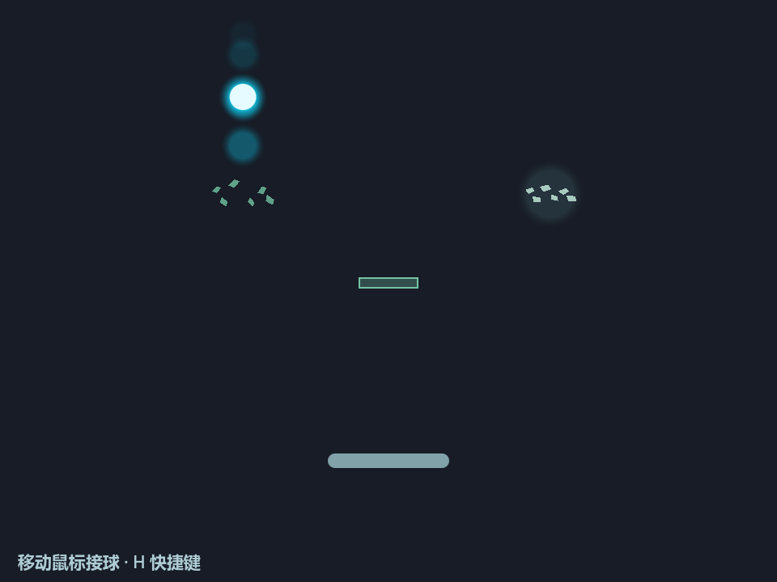

# 第三批harvest：砖块族

> 最新反馈：用户已确认 `5287a91`“基本反馈通过”，并授权[反向砖形象与脆砖微调](#refinement-20261001)。下文首版待验收与参数按原时点保留；新微调仍待试玩。

日期：2026-10-01。代码起点 `d26c9f1`；用户已明确该版通过并要求按计划继续。授权与设计依据见[当前计划](harvest-refinement-plan.md#brick-harvest-20261001)。本轮已在 `codex/harvest-geometry` 实现并通过必要机器验证，main保持 `79b9de0`，现停在人工试玩点。第三批尚未获得体验验收。

## 已确定交互与边界

普通砖被真实撞击后损伤／裂开，再碎裂消失。反向砖初始碎散且有特殊颜色，第一次有效命中拼合完整，第二次以比普通砖更强的声画彻底摔碎；两次应是不同的有效接触，不能由同一持续碰撞重复消费。初始碎散也须有可理解的命中范围。

复用现有单球运动、碰撞、反馈和随机生命周期，不加积分、奖励、任务、自动延寿或持久成果。砖的可见本体默认接入共享生成避让；碎片表现保持有限资源，不提前加入结构簇。保留已有门户／纯几何／底座对照与组合复现入口；组合记录不冒充输入或球轨迹重播。

## 实际实现与临时参数

来源为 `4947b67` 的 `scripts/toybox/contact_toys.gd`，选择普通砖的真实接触、裂纹与有限碎裂表现；不迁入旧限速680、补能、再生、peg或其他族。新增一个 `BrickToys` 族供普通／反向砖共用，Main注册已有SpawnOccupancy，Ball在真实物理碰撞提交后显式通知砖族；GeometryPlayground统一随机重开、既有声画事件与组合记录。共享占用服务不增加砖类型清单。

| 临时参数 | 初版选择 |
| --- | --- |
| 同时数量上限 | 3块，普通／反向混合 |
| 首次生成／后续尝试间隔 | 2–4秒／5–8秒 |
| 有限位置候选 | 每次最多24个，无空位延后 |
| 自然寿命／淡入淡出 | 14–22秒／各0.65秒 |
| 砖面／完整碎散占位 | 72×28／84×40逻辑像素 |
| 普通砖耐久 | 两次不同有效命中 |
| 反向砖拼合 | 0.28秒；拼合中可靠反弹，不消费第二次 |
| 接触解锁 | 真实朝内冲量至少30；按球与砖锁定，至少0.12秒且离开完整范围＋球半径＋2后再计数 |
| 碎片 | 每次6片短时视觉碎片，不新增物理实体 |

以上为代理试作选择，不代表用户指定或已验收参数。反向初始碎散保留可理解的命中轮廓；首次拼合不重置寿命，拼合完成后须离开并再碰撞才触发更强摔碎。碎裂关闭碰撞，短反馈后离场，不再生、不保存永久成果；有限声部沿用现有反馈。不会把同一帧或持续压住的重复接触记作两次命中。

默认累积模式采用外层version4、`world_mode=coexistence-bricks`、`latest-bricks.json`，包含门户。`--no-bricks`保留当前v3门户对照；`--no-portals`、纯几何和底座继续各自旧模式，不意外加砖。R／N重开本模式全部对象；F8／F9先验证全部schema与共享占位，再修改世界。默认v4拒绝v3且保留当前状态，旧组合在对应对照入口恢复；球相关接触锁随安全重新发球清空，不声称完整输入重播。

## 分工与证据

6.1 Sol（`gpt-6.1-sol`，medium为执行选择）负责运行时、接线、声画、测试及修复；主代理负责文档、需求／约束／风险审查和已授权本地Git保存。最终命令、退出码、时点、日志、截图／动态片段与源文件指纹保存在 `.godot/brick-harvest-20261001/`。实施选择、机器结果、代理观察和用户体验分别记录。

原始 `docs/user-feedback.md` 保持未跟踪与原字节，起点SHA-256：`78929B277A53557896D3C993F38B17A1962312D6501C1131534D63212A39DB37`。

## 本轮机器验证与实际演化

Windows／Godot4.7 Compatibility，沿用本机console，日志写入仓库 `.godot/brick-harvest-20261001/`。最终适用检查共3889项，导入（包括六张归档图）与默认seed184场景1200帧启动均退出0；最终日志无SCRIPT ERROR／ERROR或泄漏。证据于2026-10-01 14:14:38 +08封存于 `report.md`、`results.json`、`fingerprints.json`；主代理核对5个运行时及6个测试／探针源文件指纹一致，均为LF，最终回归后未修改源码。运行时代码起点为 `d26c9f1`，用户验收与本轮设计文档停点为 `c8d40b2`。

| 范围 | 最终结果 |
| --- | --- |
| 砖块专项 | 55：真实高速碰撞、独立命中与去重、拼合中回撞、离开再撞、寿命不延长、状态／重复ID等无效快照拒绝、生成与出口避让 |
| 新音频 | 9：裂纹／碎裂／拼合／强碎波形、强弱关系与既有声音限制 |
| 核心与物理 | 572；显式current／no-bricks底座物理851，默认fast由砖专项覆盖 |
| 门户／原共存／几何／共享占用 | no-bricks门户39、无门户共存2136、几何45、占用50 |
| 音频回归 | 基础38、几何反馈37 |
| 六入口 | 共57，包含默认、固定、no-bricks、no-portals、纯几何、底座；R／N／F8／F9和模式隔离 |

保留首个缺砖红测试、快照重复ID红测试与早期退出时音频对象未排空的阶段日志；测试收尾按既有方式等待300毫秒排空，修正后重新验证，早期有错误的输出不计通过。运行时最终仅微调有界装饰碎片从砖面六格原位向外散开，避免起点聚拢；不改变运动、生成、碰撞或计时。相应受控真实渲染与最终专项已补验。

seed184自然实际运行120秒／7200物理帧，只有脚本挡板输入，未强制砖状态或碰撞；12次砖事件覆盖普通裂／碎、反向拼合／强碎，门户自然传送3次，最多3砖、跨族本体包络重叠0。该自然片段早于最后的重复ID快照校验及纯装饰碎片起点调整，其运动／生成／碰撞统计仍适用，旧画面不冒充最终声画。最终视觉证据采用下方重跑的受控真实碰撞过程，受控事件不算自然发生；完整时序见 `controlled.json`。

| 普通砖 | 反向砖 |
| --- | --- |
| [命中裂纹](images/brick-batch3-ordinary-cracked.png) | [初始碎散](images/brick-batch3-reverse-scattered.png) |
| [碎裂离场](images/brick-batch3-ordinary-shattering.png) | [正在拼合](images/brick-batch3-reverse-assembling.png) |
| — | [拼合完整](images/brick-batch3-reverse-assembled.png) |
| — | [再次命中强碎](images/brick-batch3-reverse-shattering.png) |

实现代理查看最终六图，主代理因捕获时序疑点定向查看代表帧并确认强碎后六片散落；未重复游戏测试。归档与 `.godot/brick-harvest-20261001/` 同名源图逐张SHA256一致，源文件保留。捕获静音；声音仅以波形／路由／增益证据说明，反向强碎波形能量约27.92、普通碎裂约18.15，实际增益约0.178与0.132，加权波形能量约为普通碎裂的2.773倍；沿用最多三声部，饱和时仍可能丢弃声音，不能据此宣布人耳听感通过。

## 试玩与保留边界

默认[run-playtest.bat](../../run-playtest.bat)或编辑器F5为累积砖块版；`run-playtest.bat --no-bricks --geometry-seed=184`回到用户已验收的门户版。`--no-portals`继续旧几何＋原世界，无砖；纯几何／底座入口保持。R保持种子、N换种子，F8保存、F9恢复当前模式组合，最近文件互不覆盖。

本批已实现并通过机器验证，代理观察不代表用户体验。仍待试玩判断普通砖是否值得再撞一次、反向拼合／再摔的反差是否清楚、混合密度与声音是否合适。不会自动合入main或引入结构簇。F01／F05、F07、T01等既有开放项保持，用户原稿保持未跟踪与原字节。

## 2026-10-01：反向砖形象与脆砖微调

用户针对 `5287a91` 反馈“基本反馈通过”，提出反向砖形象应与普通碎裂基本一致、通过球体类似光晕提示特殊性，以及增加一次碰撞即可破坏的脆砖。主代理建议自然紧凑的同类碎片、撤去机关感边框／规则排布，拼合后仍保留淡光晕；脆砖轻薄、较常见、替换原有生成份额，保持总量／寿命／频率。用户随后明确“执行吧”，本轮按该设计实施。

反向砖复用普通碎裂的形状语言，初始自然散落但限制在完整本体占位内，以柔光而非强烈颜色／符号标示特殊性；命中范围仍须可理解。两次不同有效接触、0.28秒拼合和不延寿规则保持。脆砖在同一族内以一次命中变体实现，轻薄视觉与真实碰撞一致，不加专属光效或新系统。暂定脆砖／普通／反向权重60%／25%／15%，属于代理试作参数；最多3块、出现时序、14–22秒寿命及球速均不改变。

实际形状选择：脆砖绘制与碰撞均72×12，继续保守占位84×40；反向砖碰撞72×28不变。外层组合v4保留，砖子快照升为v2并记录生成规则 `fragile60-ordinary25-reverse15`。旧v4／砖v1继续接受，以 `legacy-two-kind` 保留旧普通／反向各半的后续抽样；R／N重新开局才采用新默认。旧v1不接受脆砖，新v2拒绝未知规则与不合法类型／状态组合；兼容不静默改变旧随机进度的意义。

运行时与测试继续由6.1 Sol（medium为执行选择）负责，主代理维护文档与本地Git。最终证据放 `.godot/brick-refinement-20261001/`；需覆盖脆砖实际一次碰撞、原两种砖规则、快照兼容与占用、混合种子运行、最终渲染及阶段导入／1200帧启动。机器通过、代理观察与新微调的用户验收分别记录；不自动合入main，不将基本反馈通过扩写为所有既有开放问题关闭。

### 微调实际实现与证据

本轮运行时改动仅在 `brick_toys.gd`：三类砖共用生命周期、保守占位与真实接触；脆砖使用72×12碰撞／绘制，第一次有效命中即调用既有普通碎裂事件。反向初始与普通碎裂共用不规则六片多边形，撤去网格式排布、强紫边框和机关标识；初始、拼合及完整状态使用柔和青白光晕。光晕属于装饰，不扩大本体禁入范围。既有普通两击、反向拼合／再撞规则、声音接线和所有已验收运动参数保持。

本轮最终共1548项适用检查通过，包含显式current／no-bricks物理851；七图导入与默认seed184场景1200帧均退出0，最终日志无SCRIPT ERROR／ERROR或泄漏。2026-10-01 14:42:04 +08封存 `report.md`、`results.json`、`fingerprints.json`；主代理核对1个运行时及3个测试／探针源文件指纹一致、全部LF，所有最终证据在最后源码修改之后。声音沿用原普通碎裂事件，未改音频，因此未重复无关音频回归。

新专项42项、原砖流程55项、核心572项、默认／no-bricks入口15／13项通过。真实落盘旧v4／砖v1与新v2恢复均覆盖；发现并修正了JSON版本数字表示导致的旧文件拒绝，最终同时拒绝不支持版本与错误类型，未放宽其他schema。保留首红、阶段失败与最终日志，内存快照通过不冒充文件恢复通过。

最终受控实际运动包含普通裂／碎、反向拼合／强碎与脆砖首次碰撞碎裂，截帧静音；实现代理查看完整过程，主代理为归档查看同屏形态对照、三类初始与脆砖碎裂代表帧。七张最终截图已与源文件逐张核对SHA256一致并归档，旧首版图片保留。

对照图为受控真实运动后的截帧：左侧普通砖碎片、右侧带柔光的反向初始碎片，下方为脆砖。其余过程：[三类初始](images/brick-refinement-mixed-initial.png)、[脆砖首次碰撞碎裂](images/brick-refinement-fragile-shattering.png)、[普通砖裂纹](images/brick-refinement-ordinary-cracked.png)、[反向拼合中](images/brick-refinement-reverse-assembling.png)、[拼合完整](images/brick-refinement-reverse-assembled.png)、[再次强碎](images/brick-refinement-reverse-shattering.png)。受控状态不记为自然随机发生。

最终代码的seed184自然片段为7200物理帧／120秒，仅脚本挡板输入；生成脆砖12、普通4、反向2，共18块（这是一次实际分布，不等于精确目标比例）。发生16次砖事件、2次门户传送，最多3砖，跨族本体重叠0、越界恢复0、碰撞预算耗尽0；未强制初态或提高频率。单种子结果不代替长期体验，完整生命周期与事件时点保留在 `natural.json`。

默认入口仍是[run-playtest.bat](../../run-playtest.bat)，`--no-bricks`仍回到门户版；原砖初版可返回 `5287a91`。新比例只替换砖的种类份额，最多3砖、2–4秒首次等待、5–8秒后续尝试、14–22秒寿命均保持。用户对初版的基本反馈通过不覆盖本次新外形／脆砖手感，现停在新一轮人工试玩点；main保持 `79b9de0`。

## 2026-10-01：两分钟未遇到反向砖的定向检查

用户在 `027ebf7` 约两分钟试玩中未观察到反向砖，要求检查代码；原局种子未提供，以下复现同类现象，不声称重放用户原局。6.1 Sol按生成抽样→合法位置→生命周期→绘制逐层调查，产品代码和参数未修改，诊断探针仅保存于 `.godot/reverse-spawn-investigation-20261001/`。

代码先找到合法位置，再按60%／25%／15%独立抽取种类；三种砖共用84×40保守占位，反向砖没有额外的位置过滤。没有防止长时间不出现的机制，15%也不是每段两分钟必须出现的配额。连续18次独立抽样均未选中反向砖的概率约5.36%；这仅说明随机空窗的量级，不代替实际场景统计。

21个实际生成／物理生命周期种子窗口中，seed2和10在两分钟内零反向砖（样本2/21，不作为总体概率估计）。seed2成功抽样18次仍未选中反向；seed1生成2次，均进入active，可绘制累计约35.92秒。全部样本的50块反向砖均激活，未发现抽中后被单独丢弃或生命周期隐藏的缺陷；有限生成失败来自最多3块的数量限制，未发生24次位置候选全部耗尽。位置候选数不作为种类抽样次数。

结论：当前实现能够产生用户描述的两分钟空窗，证据指向独立低权重随机所允许的结果，不是反向砖分支失效。此前seed184出现两块，只能证明该局可达，不能保证短试玩中都能遇到。若要减少这种空窗，需要另外明确生成节奏策略（例如连续未出现后的权重保护）；本次检查未擅自提高概率或添加保底。反向砖现在是青白柔光中的碎片，已不再使用首版紫色机关轮廓；可见性与用户辨识体验仍不能仅凭计数宣布成立。

统计口径按模拟时间[0,120]的实际attempt事件统一：21窗共371次成功种类抽样、50次反向生成且全部激活。seed16边界帧的原JSON标量先于事件采样，少计一次脆砖；原文件保留，汇总以事件为准，不计为产品缺陷。直接使用未替换产品模块的seed1短渲染正常退出0，首次反向active截图对应模拟10.333秒，主代理定向查看确认六片与淡光晕可见。两段较长并行渲染因耗时异常主动终止、退出1且未完成JSON，其部分图不作为完整两分钟证据；没有为此追加全套验证。批量生命周期与短渲染的用途分别记录，实际脚本输入不等于用户原局重播。

调查命令、退出码、原始JSON、截图、探针及源文件指纹保存在 `.godot/reverse-spawn-investigation-20261001/`；运行时仍为 `027ebf7`，只追加本节记录，不调整生成权重、外观或任何其他游戏规则。
