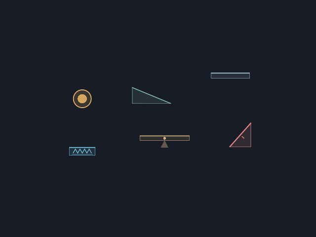
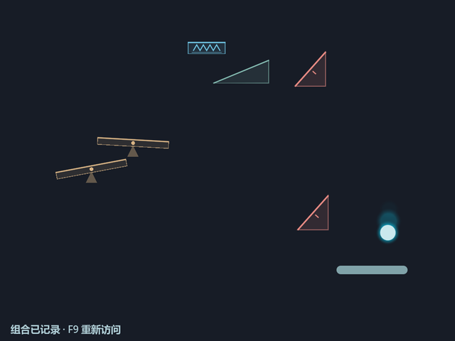
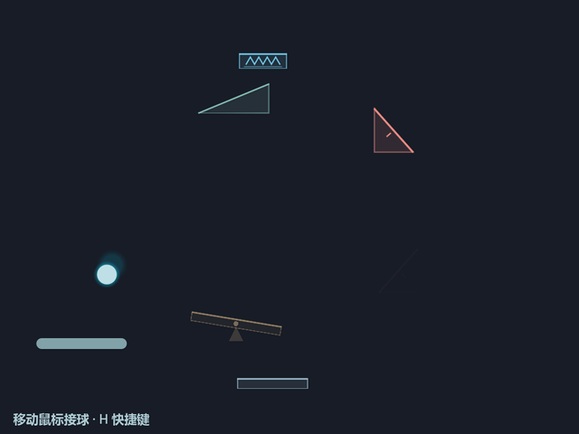

# 第一批集成：几何实体与机械机关

初版日期：2026-09-14；refinement反馈：2026-09-16；安全停点收口：2026-09-20至22。依据：[分批集成与打磨方案](harvest-refinement-plan.md)、用户实际试玩反馈及最新“把中间改动做到最近安全停点，然后提交”的指令。实现与验证：Codex low代理；方向、结果判断、文档与Git：主代理。

上述low代理及下方主代理复核描述属于既有执行记录。旧版[代理纪律记录](../../AGENTS.md#agent-execution-policy)描述当时分工；其指令现已撤销，本轮仍按对话明确约定采用：Astra主代理、Sol medium普通实现、Luna medium明确小活；主代理强度由用户控制，默认不复跑已完成测试或阅读完整实现。实现／集成代理按统一格式提供最终状态的可审计证据，深入检查由具体疑点触发。

状态（2026-09-23）：第一批初版 `ee6b25b` 已经过用户试玩，代码安全停点已保存为 `d761c98`，分支 `codex/harvest-geometry`。随后两轮定向调查及已明确的反馈问题已归档。本轮从 `b370756` 开始实施第一运动A/B停点，具体边界与验证记录见下节。main仍为 `f792d3b`，第二、三批不启动。安全停点、机器证据与问题登记都不等于新体验已获验收。

<a id="paddle-accent-removal-20260930"></a>

## 2026-09-30：撤下挡板独立受击亮边

用户反馈：**当前实现效果不佳，之后进一步优化UI/UX时再考虑该方案。** 按此从 `665141d` 移除独立亮边的状态、绘制、接线及专属测试；混合测试中的球法向形变、声音层次和Ground→Paddle优先级检查保留，不把整个F09回退。Vitality传递变暗、1.5×运动和弹簧动作保持；本轮不制作替代特效，也不把剩余声音／形变视为已获体验验收。

状态：删除完成。保留的测试通过572项检查，headless导入与默认场景1200帧短启动均退出0，亮边专属符号无残留。命令与源文件SHA256见本地 `.godot/remove-paddle-accent-20260930/results.json`；采样脚本尝试未生成证据，不计为通过，本次纯删除不依赖截图验收。用户指定的反馈已追加到 `docs/user-feedback.md` 的“once rejected & why”，此前原文按字节保留，文件继续保持未跟踪；其9月23日SHA记录属于历史，不能再用作本轮追加后的原稿指纹。下方9月25日实现参数和证据保留为历史，不代表亮边仍为当前方案。

<a id="paddle-feedback-20260925"></a>

## 2026-09-25：球—挡板接触反馈（F09）

起点 `3088ca3`，运行时代码 `b118a5d` 已获用户试玩通过。用户要求继续下一项，本轮仅实现已确认的独立挡板接触反馈。仓库现位于 `D:\PROJECTS\Bounce Lite`；原目录已不存在，历史审计中的旧绝对路径不改写为新执行记录。此前提供的AGENTS指令已由用户撤销；本轮分工与边界依据对话中明确的用户要求：Sol medium实现及必要验证，主代理负责方向、约束／风险审查、文档和Git，不例行重复完整检查。

状态：已实现，本轮必要机器验证通过；等待人工试玩验收。独立短促亮边用于呈现真实挡板接触；球压缩与声音按法向碰撞力度作有限变化；处理地面音紧邻挡板接触的优先级，保留Vitality传递变暗但不让其兼任全部接触反馈。有效顶面与侧／底面接触需保持原语义，鼠标空移不生成碰撞反馈。具体呈现形式与参数见下表，均为本轮试玩值。

默认1.5×运动、重力2.25×、弹簧0.20秒／50%有上限横速保留、挡板y570与既有碰撞／Vitality／Wake／Continue规则保持。此项不加入挡板移速传递、命中加快消失、挡板下移或下一批机制。验证区分受控触发、真实碰撞、画面证据、音频请求与人工听感；完成后更新文档、本地保存并停下供人工检查，不自动合入main。

### 实际反馈与参数

共同力度来源为真实入射速度沿单位接触法线的接近分量 `max(0, -velocity_before · normal)`，不把切向高速算作重击。独立亮边和球压缩覆盖真实顶面、侧面、底面接触；有效顶面判定与Vitality补能规则保持，侧／底面不冒充能量传递，鼠标空移不触发接触。

| 表现 | 本轮实际实现 |
| --- | --- |
| 挡板亮边 | 在对应受击边局部绘制；法向30–370映射强度，正接触下限0.08、上限1；持续0.16秒，强度二次回落。顶／底边总长约26–62逻辑像素，线宽2–4，alpha为0.38+0.52×强度；不改变碰撞矩形 |
| 球形变 | 法向30–420映射压缩0.96→0.80、正交拉伸1.04→1.18，沿碰撞法线选轴，按原恢复机制回落 |
| 挡板声音 | 法向45–420映射基准−23dB上的−2到+2dB变化，音高倍率0.96–1.08；有效顶面保留轻接触声音，侧／底面沿原有效性语义处理 |
| 地面音邻接优先 | Ground→Paddle在40ms窗口内允许挡板优先，保留每事件冷却；正在播放的Ground从−25压至−33dB，不硬停、不逐次累减，下次独立Ground恢复−25dB |
| 能量表达 | 原Vitality传递变暗保留，与接触亮边分开；满活力或本次不补能的真实接触也有独立反馈 |

### 本轮证据与交付边界

实现与必要验证由Sol medium完成。`.godot/paddle-feedback-20260925/results.json`记录9项实际命令、退出码和日志，全部为0：核心、基础物理（显式baseline/current）、音频场景、几何音频、几何场景、E01、headless import、默认Main1200帧及最终核心补验。最后仅增加duck边界专项断言，`core-current-final.log`为584项通过；运行时代码在其余最终检查后未再改动。文件mtime与SHA-256封存于 `final-fingerprints.json`，最后核心检查后仅由主代理清理提交检查发现的末尾多余空行及捕获脚本一处行尾空格；逐文件确认去掉这些空白后的内容完全相同，没有逻辑变更，不因此重跑游戏测试，指纹已更新。

专项覆盖弱／中／强法向、切向高速、低／满Vitality、侧／底面、空鼠标、亮边消退，及Ground后20ms的Paddle优先、声音参数差异、duck不累减和下次Ground音量恢复。没有用放宽物理断言代替反馈验证，也没有重跑无关长期探索。

实现代理已实际捕获并查看OpenGL的 `weak.png`、`strong.png`、`recovered.png` 与dynamic片段：弱反馈较轻，强接触亮边可辨，恢复帧不残留亮边。`capture-evidence.json`分别标注受控视觉响应与24帧真实引擎运动，后者实际发生1次Paddle接触；不能把受控截图写成自然长时试玩。

捕获脚本开启静音，因此受控记录中的−23dB／pitch1为播放器初始化值，不构成声音分层证据。音频结论来自专项实际请求／播放器参数断言，人工听感与整体触感仍待试玩。没有用波形图片或机器检查代替人工听觉验收。

代理在报告整理阶段迟滞，最终通过对话交付上述具体事实；主代理只定向核对缺失参数行、现有结果和文件状态，补写本机 `report.md` 与指纹，没有重复游戏验证或代写运行时。T01既有挡板侧向接触未宣告修复，F01／F05与其他问题不自动关闭。此停点本地保存后停止供人工检查，main不合入，下一批不启动。

<a id="spring-refinement-15x"></a>

## 2026-09-23：1.5×运动尺度与弹簧refinement

起点 `60e3516`。用户要求“按比例调为速度1.5x，然后继续下一项”；本轮将fast改为速度1.5×、重力2.25×，作为后续默认试玩尺度，current仍为1×对照。随后处理已批准的F02弹簧衔接；不把这次继续授权写成上一轮所有体验问题已验收。实现／必要验证由Sol medium负责，主代理同步文档、审查约束与风险、执行Git。

状态：实现提交 `b118a5d` 已通过必要机器验证；用户随后明确反馈“这一版通过了”，本停点人工试玩通过。两档共同试作0.20秒持球、保留约50%真实来球横向速度并设置相对上限，保持清楚的落座—压缩—释放。正常和异常兜底使用同一参数来源与释放计算；重开、快照恢复和结束时清理临时入射记忆。横速上限取共享总速预算 `sqrt(max(0, max_speed² - spring_release_speed²))`，1×约142.83、1.5×约214.24；先保留50%再限幅。默认参数下不会因保留横速截断竖直释放，F1若将总上限调到低于竖直释放仍需最终总限幅。所有数值均为试玩参数，最终机器证据见交付记录。

| 来源 | current对照 | fast／新默认 |
| --- | ---: | ---: |
| 速度倍率／重力倍率 | 1／1 | 1.5／2.25 |
| 初速／总限速 | 360／520 | 540／780 |
| 重力 | 260 | 585 |
| Wake／Continue | 350／290 | 525／435 |
| 挡板冲量 | 160 | 240 |
| 弹跳器／侧踢 | 380／440 | 570／660 |
| 弹簧竖直释放 | 500 | 750 |
| 停稳／捕获速度阈值 | 45／35 | 67.5／52.5 |
| 独立拖影标尺 | 520 | 780 |

入口：[默认1.5×试玩](../../run-motion-fast.bat)、[1×对照](../../run-motion-current.bat)。两者都包含本轮新弹簧动作；不是新旧弹簧独立A/B。无参数启动也采用1.5×；严格的2×强对照与旧弹簧可回到 `60e3516`。新快照外层仍为version2／geometry-refinement-v2，新增 `rules=spring-200ms-lateral50-motion150`，同时要求motion_profile一致；缺少规则标识的旧组合及异规则／异档组合在修改当前世界前拒绝，不覆盖原文件。

挡板保持y=570，不加入挡板移速传递或命中加快消失；独立挡板接触反馈仍待下一项。对象寿命、生成频率与冷却不随速度统一缩短，不改main或启动下一批。完成本停点后停止供人工检查。

### 本轮验证与证据

Sol medium在Windows／Godot4.7执行并冻结14个运行时／测试文件（含新UID）。`.godot/spring-refinement-15x/results.json`保存18项最终执行的实际命令、时点、退出码与日志，全部退出0；包含核心558项、基础物理851项（显式baseline／current）、机械69项、refinement29项、两档弹簧专项各33项、场景／入口、headless import、两档Main各1200帧和后续运行／捕获。无参数入口另有 `green-test_motion_entry.log` 明确为fast；两档最终显式入口各16项。先红后绿证据为同目录 `red-motion.log`、`red-entry.log`、`red-spring.log`。

弹簧专项覆盖真实左右／零／大横速捕获、正常释放、捕获提交失败、对象失效与超时兜底；重开、新active周期、恢复和释放结束会清理临时入射记忆。初版测试fixture曾被上一例释放后的球干扰，修正为每例停球、重建固定弹簧再放球，未据此放宽产品断言。既有音频接线未修改；真实seat／compress／release事件序列作为本轮阶段反馈证据，不冒充人工听感验收。

seed184两档各60秒自然观察，几何重叠、越界恢复与碰撞预算耗尽均0，未观察到新的产品故障；这次也没有挡板重叠，但T01不因此关闭。current自然出现一次完整弹簧序列，fast本片段未自然碰到弹簧，因此另用固定布局真实物理受控捕获验证两档动作，不能将受控覆盖写成随机命中证据。

实现代理实际捕获并查看两档OpenGL落座／压缩／释放图：`.godot/spring-refinement-15x/spring-{current,fast}-{seat,compress,release}.png`。初始来球速度(120,180)，fast的seat／compress／release事件时刻分别约0.1667／0.2167／0.3833秒；释放后采样横速60，竖直速度−730.5是释放750后已受重力影响的数值。事件与捕帧数据见 `capture-current.json`、`capture-fast.json`，没有用单张截图代替真实动作过程。

简短审计为 `.godot/spring-refinement-15x/report.md`，最终SHA-256／mtime为 `final-fingerprints.json`。最终相关修改后已补跑受影响项，之后无运行时变更。主代理审查范围与证据并核对指纹，不重复游戏测试。无参数／显式profile通过直接Godot入口验证；现有bat未修改，本轮没有新增bat实际运行验证。第一停点历史日志、旧快照与原始反馈均保留。

人工检查更新：用户针对 `b118a5d` 明确反馈“这一版通过了”。记录为本轮1.5×运动尺度与弹簧refinement的整体试玩通过，可保留为后续打磨起点；不据此推断F01／F05等问题逐项关闭、T01已修复或参数永久冻结。下一项独立挡板接触反馈仍未实施；本次仅记录验收，不启动下一项、不合入main。


<a id="motion-ab-checkpoint"></a>

## 2026-09-23：第一运动A/B停点（历史：`60e3516`）

状态：第一运动A/B已实现，本轮必要机器验证通过；停在人工试玩检查点，未获得体验验收。实现／集成：Sol medium；两个启动入口：Luna medium；约束、风险、文档与Git：Astra，强度由用户控制。起点 `b370756`（运行时代码安全停点 `d761c98`）。

依据是用户转述的朋友试玩反馈：偏慢的球路让持续弹动和碰撞的乐趣被稀释。因此本轮测试**保留大致空间轨迹尺度、提高单位时间内物理事件密度**的体验假设。速度×2、重力×4是刻意明显的强对照，不是最终参数，也不要求机械动作统一同比缩短。

本停点只统一运动参数归属、清理碰撞响应与限幅耦合，再提供current／fast两套运动尺度。两者都保留挡板y=570、弹簧0.32秒持球、原有接触反馈及世界生成时间。A是同一清理后实现的当前尺度，不是 `d761c98` 的逐字节历史版本。详细授权与后续候选见[方案](harvest-refinement-plan.md#motion-ab-checkpoint)。

直接入口：[A 当前尺度](../../run-motion-current.bat)、[B 提速对照](../../run-motion-fast.bat)，同为种子184；默认入口仍为current。完成后停止，人工观察节奏与F01／F05重新接入，再决定后续；不自动下移挡板或推进下一批。

### 验证中发现的净空与观察器问题

高速验证初次并行观察在fast／seed20260914记录189帧几何重叠及189帧碰撞预算耗尽，每帧碰撞上限仍为4；单独复跑60秒与120秒为0／0。原始日志保留，首份JSON被后续运行覆盖，不能声称保留了首次重叠对象样本，也不能直接把复跑通过当作失败无效。

由具体风险触发Sol medium窄范围只读审查，未重跑全套测试。审查发现旧观察器每轮固定推进挡板后等待physics_frame与process_frame，负载下可能跨多个物理tick，影响同种子的控制与采样。因此实现代理调整观察为实际物理tick对齐、各次独立保存产物。

另有确定性红测确认：旧生成允许平台底缘y543，挡板顶面y561，18像素间隙不足32像素球径。第一批实体生成净空改为至少球径加2像素，A/B共用，挡板仍y570；没有把这个规则推广为其他机制永久禁区。此修正改变部分可生成位置，属于A也包含的技术修正。尚不能证明该夹缝就是首次189帧异常的根因；最终回归结果另记。

修正后逐物理tick的成对60秒观察（每档seed184与20260914）均无几何重叠、无异常恢复，最大采样间隔1物理tick。B／20260914仍记录1帧碰撞预算耗尽，后续继续有碰撞与机关事件，没有持续重叠或锁死证据。单帧有限停步与此前189帧重叠不混为同一问题；观察器保留预算统计与碰撞路径，断言针对持续耗尽（连续不超过2帧）、零几何重叠和零异常恢复，而非把“永不触及预算”新增为产品规格。该结论有运行覆盖限制，不证明所有随机组合安全。

定向捕获的fast／20260914第3331帧路径为Paddle → Paddle → LeftWall → Paddle，剩余位移比例0.1866，球位置(22.239,561.645)、速度(-873.28,375.77)；下一物理帧位置(26.329,543.496)、速度(984.84,-156.82)，已脱离。连续预算耗尽最长1帧，几何重叠及越界恢复均0；这是挡板靠墙接触路径的有限停步，归入T01继续跟踪，不宣称T01已经修复。证据为 `.godot/motion-ab/observation-fast-budget-review.json` 与同名log，7836项检查通过。

### 对照参数与时间分类

以下为本轮已实现的强对照参数，属于试玩值而非最终规格。

| 运动来源 | A current | B fast |
| --- | ---: | ---: |
| 初始速度 | 360 | 720 |
| 全局速度上限 | 520 | 1040 |
| 重力 | 260 | 1040 |
| Wake起跳 | 350 | 700 |
| Continue起跳 | 290 | 580 |
| 挡板额外冲量 | 160 | 320 |
| 弹跳器法向最低速度 | 380 | 760 |
| 侧踢法向最低速度 | 440 | 880 |
| 弹簧正常／兜底释放 | 500 | 1000 |

拖影使用独立速度参考，不再把F1限速变化解释为视觉强度变化。物理速度阈值单独核对；人的反应时间、挡板平滑、机械动作、安全冷却、对象生命周期和生成时间不是同一类参数。尤其当前弹簧持球0.32秒不缩短，仍清除横向来速；后续约0.20秒与约50%横速保留尚未实施。


### 参数归属、快照与最终证据

所有运动速度来源现由同一个PrototypeTuning提供给Main、Ball及GeometryToys。普通基础表面保留原反弹与Vitality规则；几何接触继续从入射速度计算形状反射，主动机关补足法向速度，跷跷板以相对移动表面速度反射，之后由Ball应用共享总限幅。没有额外引入通用几何阻尼或补能。跷跷板角响应取限幅前的法向动量交换，再按力臂作用，避免把总限幅的切向截断算作真实碰撞冲量。

物理阈值RESTING停稳速度45→90、弹簧捕获速度35→70随档位调整；拖影独立参考520／1040。Wake／Continue等待与资格、机关0.12秒冷却、弹簧0.32秒持球／1秒重捕获／1.2秒异常持球兜底、挡板平滑18、每帧4次碰撞预算、对象10–24秒寿命／1.5–3.5秒生成间隔／0.65秒淡出均未机械缩放。生命与活力规则仍可能使更快碰撞带来更快耗散，这属于本次整体体验需要观察的结果。

R按当前种子重开，N换种子，均保留所选motion profile及当次F1临时调参；F1不触发再次倍乘。窗口标题与日志标明current／fast。F8组合外层仍为version2／geometry-refinement-v2，但新增motion_profile；F9拒绝缺少档位的旧记录及异档记录，并提示“运动配置不匹配；旧记录需在原版打开”，不悄悄切档。几何内层继续校验类型、数值、完整包络和数量。快照保存组合条件而非完整输入、F1设置或物理状态重播。

本轮机器执行者为Sol medium，平台Windows／Godot4.7。2026-09-23 15:29:18–15:31:07（+08:00）最终16项执行记录退出码全0：核心runner558项，基础物理851项，几何／机械／refinement／场景／入口、运动profile／净空／两档入口、两组音频、headless import、两档主场景各1200帧。完整命令、退出码与时点见 `.godot/motion-ab/final-check-results.json`；各日志为同目录 `final-*.log`。其后仅加强 `test_motion_entry.gd` 的R／N断言，并在15:31:39／44补跑current／fast各13项通过，运行时代码没有测试后变更。

基础物理851项实际使用 `--v02-baseline --motion-profile=current`。此前默认随机模式发生1项补能断言失败（检查前额外几何碰撞造成0.985衰减），固定几何也干扰该基础fixture；没有放宽断言，也不能把baseline通过称为默认随机全套通过。默认随机模式另有几何场景、逐物理tick自然观察覆盖。对照自然运行每档两个种子各60秒：seed184／20260914的表面接触数A为83／81，B为155／282；机关事件A31／19、B28／96，RESTING帧A108／108、B270／216。这些是特定输入和片段的事件计数，不是趣味性评分；预算帧与旧失败的限制见上节。

实际OpenGL渲染由实现代理捕获并查看，种子184两档各0／120帧，画面无遮挡、球路分化；证据为 `.godot/motion-ab/render-{current,fast}-{000,120}.png` 及 `render-*-visible.log`。两份bat由Luna静态检查；Godot直接参数与profile集成已验证，但临时cmd冒烟封装因引号失败，真实bat运行未据此确认，未留下该检查启动的游戏进程。

原实现代理因用量中断未交付完整总结，之后的报告收尾迟滞；Luna仅整理现有证据形成 `.godot/motion-ab/closeout-report.md` 与 `final-fingerprints.json`，不冒充新增测试。主代理按约束、风险与证据审查；因报告缺少关键归属说明而定向查看运行时差异，没有重跑游戏测试。文件指纹与mtime用于核对最终状态，以上关键结论在本文持久记录，忽略目录中的日志仍是本机审计资产。

第一停点完成后停止供人工试玩。F03尚待判断是否更有趣，F01／F05重新接入未宣告解决，T01挡板靠墙短接触仍开放；不自动下移挡板、实施后续弹簧／接触反馈或启动传送门。

<a id="motion-investigation-20260923"></a>

## 2026-09-23：基础手感与速度控制调查

调查对象：`d761c98`。第一轮为只读源码加必要的受控headless效果探针，第二轮只读追踪速度来源、覆盖关系及耦合，未新增效果测试。探针由low代理执行，主代理核对源文件、原始输出和结论边界。运行平台Windows / Godot 4.7。用户反馈问题与方案状态集中见[正式问题登记F01–F09](toybox-playtest.md)，处理方向见[方案](harvest-refinement-plan.md#feedback-refinement-20260923)，不把调查发现直接当成已批准的代码修改。

### 受控探针：实际测到的结果

运动探针实例化真实Main／Ball／Paddle，移除几何场景，用60Hz固定步长推进真实物理。初态受控：起跳试验把球放到底部并设置为RESTING，直接提供Wake动作量或Continue资格；不是人工鼠标操作的触发成功率测试。每个片段6秒，分别保留挡板在球上方、将其移开，以及在球心越过指定高度后自动回移挡板。对照共享速度上限520／1040，其他值不变。

| 项目 | 探针结果 | 解释边界 |
| --- | --- | --- |
| 挡板留在正上方 | Wake350／Continue290均撞挡板底面，6秒内回到RESTING；抬高上限不改变结果 | 真实空间阻挡，不等于Wake／Continue没有触发 |
| Continue无遮挡首跳 | 球心最低y（最高位置）544.603，名义顶面承接高度545，含safe margin的支撑位置约544.92；球心y<545累计约0.10秒 | 高度余量不足半个逻辑像素；该指标不是人工回接容错时间的完整测量 |
| Wake无遮挡首跳 | 最高球心y471.254，约0.60秒首次越过y545，累计在其上方约1.50秒 | “首次越过时刻”与“停留窗口”不同，不能混用 |
| 自动回移挡板 | 球心y<544.9后发出回移目标，沿现有挡板平滑移动；两种起跳均实际发生有效顶面回接 | 证明可接回，不证明人容易判断、反应或完成该动作 |
| 仅上限520→1040 | 同初态空场飞行6秒，路程／6秒为242.283→274.636（约+13.35%），峰值520→580.502；Wake／Continue的发射速度与对应轨迹不变 | 片段初速360、初态球心(480,300)、方向(0.62,1)归一化；均速包含整段时间，不代表默认随机世界或长期平均速度 |

弹簧探针在固定形状对照中以初始速度(120,180)落向真实弹簧；捕获后观测速度(0,0)，释放后的下一物理帧约(0,-495.667)。代码对应正常释放500、下一帧重力作用，520上限不截断该释放。急停、清除横速及固定竖直释放是当前行为；“哪一点最影响满意度”仍为待试玩判断，不能只凭数值断言释放过强或过弱。

音频探针直接调用现有反馈对象并检查播放请求计数：有效挡板顶面命中在测试的10／44／45／300入射速度下均可请求声音、固定增益−23dB；非有效接触在45以下被过滤。先请求地面音、同一时刻再请求挡板音会被40毫秒burst间隔抑制，间隔40毫秒后可请求。此测试验证触发逻辑，不是实际扬声器录音或人工听觉评价，也未测量默认游戏中该抑制发生的频率。

本地原始证据：`.godot/spike-motion-20260923/probe.gd`、`results.json`、`godot.log`，以及 `.godot/spike-feedback-20260923/probe.gd`、`probe.log`。这些是忽略目录中的临时调查资产，不是提交的产品测试；核心初态、方法与数值已在本文持久记录，不能把该轮探针写成全量回归。后续没有补做新的声音试听或自然随机长时体验。

### 速度控制的三套来源

| 来源 | `d761c98`实际值与控制点 | 调整时的边界 |
| --- | --- | --- |
| 共享tuning | 初速360、总速度上限520、重力260、Wake350、挡板冲量160；Main将挡板Vitality恢复默认1.0覆盖为0.30 | Main、Ball、基础碰撞模型、挡板、F1共享同一引用；初速只在start_active使用，不是每帧目标速度 |
| 几何自有参数 | 独立总上限520；弹跳器法向补足380、侧踢440；弹簧释放500／持球0.32秒；跷跷板角速度上限1.8、惯量24000、阻尼3.5、回正1.8 | GeometryToys没有接入共享tuning；380／440是条件满足时的法向补足值，不是总速度目标；正常弹簧释放绕过几何contact_request末尾的局部限幅 |
| Ball固定发射／兜底 | Continue竖直290；弹簧捕获失败、缺失或异常请求时备用竖直500；持球兜底1.2秒 | 最后受共享上限约束；修改正常弹簧参数不会同步改变备用500 |

F1可以调整重力、总上限、挡板冲量、Wake相关项及部分基础碰撞／Vitality参数，不能调整初速、Continue290或几何自有值。“Launch speed”仅指Wake。F1直接改内存中的共享Resource，不持久化；R重开几何不会重建该Resource，重启进程才回到初始化值。实现依据：[参数](../../scripts/config/prototype_tuning.gd)、[Main](../../scripts/main.gd)、[F1面板](../../scripts/dev/runtime_tuning_panel.gd)、[几何接线](../../scripts/world/geometry_playground.gd)。

默认几何模式虽保留 `shared_world_enabled=true`，以启用Continue及0.30挡板恢复，但没有实例化PlayWorld，所以旧转子、能量块和漂流场不是当前默认速度来源。`--geometry-baseline`才进入旧PlayWorld对照；`--v02-baseline`关闭共享世界与几何。避免将不同入口的参数和体感混在一起比较。

### 覆盖顺序与耦合

1. **同源限幅与独立限幅要分开。** [Ball](../../scripts/ball/ball_controller.gd)在空气运动、碰撞提交和发射多次读取同一共享上限，属于防御性约束；[GeometryToys](../../scripts/world/geometry_toys.gd)的独立520则会使F1抬高上限后，普通几何仍把碰撞返回速度压回520。
2. **几何运动结果覆盖基础反弹，Vitality结果保留。** [基础模型](../../scripts/physics/surface_response_model.gd)先算反弹、限幅及活力变化；机关再从 `result.velocity_before` 重新反射或给出特殊响应，Ball替换速度后仍应用基础Vitality变化。因此调墙面反弹系数不能同步调普通几何反弹；几何之间可继续保速而活力逐次下降，后续落地时才明显影响反弹与停稳。这是当前实现事实，尚未决定是否改变。
3. **总限幅会改变局部动作。** 法向补足后限制总速度，会一起缩小切向与法向分量；380／440不是最终法向速度的无条件保证。跷跷板以碰撞前后速度差计算角冲量，因此限幅也参与板的转动结果。空气中先加重力再整体限幅，达到上限时横向速度分量也可能缩小。
4. **平均节奏与逐次耗散、停稳阈值相关。** 当前无统一空气减速系数；重力、表面恢复系数、逐碰撞Vitality损失和主动机关共同决定运动。地面、挡板、平台的停稳判断同时涉及速度阈值45和活力／支撑条件。若提速增加单位时间碰撞数，单位时间耗散也可能改变；这是因果推断，不是第二轮的新实测结果。
5. **固定时间并不随速度缩放。** Continue等待0.9秒／资格12秒，普通机关冷却0.12秒，弹簧持球0.32秒／重捕获1秒，以及对象10–24秒寿命都独立存在。更快的球路可能更早重遇冷却中的机关；同样的弹簧停顿也可能显得更长。挡板平滑18与实际位移资格同样影响重新接入，不随球速自动变化。
6. **上限还兼任视觉标尺。** [BallVisuals](../../scripts/ball/ball_visuals.gd)用当前速度／上限计算拖影数；按代码推算，同样520速度在上限520时最多4个拖影，上限1040时约2个。几何受击强度另以450归一化。球的挡板碰撞形变固定，挡板仅在实际传递Vitality时变暗；声音固定增益，均未建立统一的力度表达关系。
7. **速度、重力与空间不是同一旋钮。** 理想抛体中速度×2且重力不变，会使抛高×4、飞行时间×2；保持相同抛高而把过程时间减半则对应速度×2、重力×4。这里只是量纲说明，不是新参数方案，实际场地还有碰撞／限速／机关干预。Ball每帧最多处理4次碰撞，也意味着更高速度若进入密集路径需后续专门验证；本轮未证明该上限已成为实际故障。

本轮结论是需要明确基础运动尺度、机关有意差异、安全约束、时间参数和反馈标尺的关系，而不是简单把所有数值合成一个倍数。具体参数归并、响应规则或视觉解耦方案尚未实施；没有借调查扩大为底层重构。已知挡板侧向短重叠继续作为T01跟踪，下方安全停点的历史验证不替代这些新问题的解决。

## 2026-09-20至22：安全停点收口

本次以现有未提交代码为范围，由一个low实现代理统一负责相关四个运行时文件及已有测试，避免共享接口交叉修改；主代理处理文档、代表性运行／画面与本地提交。沿用现有分支和已确认的五项refinement要求，不重新设计、扩大机制或开启额外工作区。

本次保留并验证五项refinement改动：弹簧真实接触后的自动持球、压缩与释放；按撞击力臂转动并阻尼回复的跷跷板；实体完整运动包络避开底部与挡板横向路径；平台实际支撑／弹簧持球期间延迟离场；几何机关不再额外补充Vitality。弹簧释放时原先只赋速度就返回，导致弹簧头回弹而球当帧未运动；已用真实接触红测复现并修为同帧继续正常Physics，同时避免重复累计运动历史时间。没有修改既有挡板碰撞路径。

### 实现参数与当前入口

以下是代理实现的临时值，供继续试玩调整，不是用户逐项指定：

| 部分 | 当前安全停点 |
| --- | --- |
| 弹簧 | 自动动作0.32秒，压缩行程14，释放速度500；再次捕获冷却1秒，Ball异常持球兜底1.2秒；落座／压缩／释放声音跟随动作，物理释放先于释放音效 |
| 跷跷板 | 最大转角±0.34弧度，角速度上限1.8弧度／秒，阻尼3.5、回复强度1.8；支点偏移候选−18／0／18，实际角度同时驱动物理表面与绘制 |
| 实体区域 | 底部留空150，挡板路径额外间距18，按完整形状和跷跷板转动包络检查；仅适用于本批几何 |
| 到期离场 | 真实支撑或持球关系结束后再淡出；不设强制打断支撑的倒计时，不建立通用延寿玩法 |
| 随机节奏 | 仍最多6个实体、寿命10–24秒、常规生成间隔1.5–3.5秒，未全面重调密度 |

当前可直接运行根目录 `run-geometry.bat`，默认单球随机几何；`--geometry-seed=184`、`--geometry-fixed`、`--geometry-baseline`继续提供种子、固定形状对照及底座对照。R按当前种子重开，N换种子，F8保存当前组合，F9恢复并重新发单球。内外两层快照均为 `geometry-refinement-v2`／version2；恢复时清理孤立持球关系，明确拒绝v1。下方归档v1快照只用于 `ee6b25b` 历史对照，不能用于当前版本。

### 本次机器验证与实际观察

平台：Windows / Godot 4.7。2026-09-22在9月20日18:32最终代码上补跑：核心558项、物理851项、几何45项、机械69项、综合场景17项、基础音频38项、几何音频27项、refinement边界29项，全部退出0。边界检查包括真实释放不重叠、模块停钟时1.2秒兜底、重开／F9恢复清理持球、支撑结束后离场以及不额外补能。精确命令与退出码保留于本地 `.godot/checkpoint-20260922-test-results.json` 和对应日志；本次没有再修改运行时文件。

无参数运行 `tests/observe_geometry.gd`，三个种子各120秒，共23535项通过、退出0：

| 种子 | 几何重叠帧 | 越界恢复 | 最长持球帧（60Hz） | 挡板短重叠帧（已知基线问题） |
| --- | --- | --- | --- | --- |
| 184 | 0 | 0 | 0 | 15 |
| 20260914 | 0 | 0 | 20 | 19 |
| 7 | 0 | 0 | 0 | 16 |

三个种子均最多6个实体，速度峰值约520。seed20260914自然发生4次完整落座／压缩／释放；没有强行让每个种子都命中弹簧。无持球的两次运行不充当持球覆盖证据。日志 `.godot/checkpoint-20260922-observe.log`，完整统计 `.godot/geometry-observation.json`。

9月20日最终文件上的快照／R／N／F9入口5项、底座入口1项、隔离APPDATA的headless import及默认主场景1200帧均退出0；9月22日核对原命令和结果，未重复这些已在最终文件上通过的运行。证据 `.godot/checkpoint-test-results.json`、`checkpoint-entry*.log`、`checkpoint-import.log`、`checkpoint-main1200.log`。9月20日日志有既有系统证书读取提示，没有脚本错误。

9月20日18:31实际Main机械渲染使用固定布局与受控落球初始条件，之后由Ball物理演化；事件记录显示落座0.183秒、压缩0.25秒、释放0.517秒，跷跷板撞击后转角约0.185弧度。这组图片早于18:32最后的运动历史计时修正，属于既有渲染，未冒充9月22日最终代码的新捕获。主代理已查看落座、压缩、释放及跷跷板受击画面：可见弹簧表面下降、球离开及板面围绕支点倾斜。文件为 `.godot/checkpoint-geometry-{spring-seat,spring-compress,spring-release,seesaw-before,seesaw-impact}.png`，动态证据 `.godot/checkpoint-mechanics-evidence.json`；它们不是随机趣味性或用户听觉验收。当前差异另经一次有限范围只读审查，未发现明确阻断问题，记录 `.godot/checkpoint-20260922-review.md`。

### 已知问题与停止边界

挡板侧向移动时仍可能短暂重叠。9月20日对 `ee6b25b` Ball只读提取的定向对照，用相同12帧输入，旧／当前均为2帧重叠、终点 `(453.1469, 508.2647)`，证明该复现属于既有基线问题；没有把随机观察中的挡板计数隐藏或写成全场零重叠。原失败日志与对照保留在 `.godot/checkpoint-repro-observe.log`、`checkpoint-paddle-old.log`、`checkpoint-paddle-current.log`。

安全停点保存当前可继续试玩的候选，不把有限种子检查当作所有组合无问题的证明。弹簧动作是否满意、跷跷板因果是否清楚、声音与自然组合节奏、长期密度／寿命仍待人工判断。本次不继续打磨固定位置，不启动传送门／砖块，不合入main或推远端；本地提交后停止。

## 2026-09-16：用户反馈与本次refinement

本批职责是让不同实体通过清楚、容易理解的物理行为，使球的运动更丰富、更好玩。用户确认几何／机械结构已让世界更丰富，空中连续碰撞与运动更多样；普通几何成立。弹簧的强上抛与自行周期摆动的跷跷板仍不够有辨识度，底部实体还可能与竖直回弹形成难以重新参与的循环。

| 用户决定／需修正的问题 | 本轮实现范围 |
| --- | --- |
| 弹簧应有自己的动作 | 真实接触后自动短暂抓住、明显压缩、有力释放；视觉、声音、球运动同步，有限持球且防循环抓取 |
| 球应能把跷跷板撞动 | 取消正弦自摆，真实撞击按力臂产生有限转动；明确支点、限角、阻尼和自然回复 |
| 底部提高重新参与机会 | 第一批实体按完整包络避开底部回弹区和挡板整条横向路径；摆板按偏支点及全摆角包络检查 |
| 支撑中的平台突然踩空 | 寿命到期时保留实际支撑关系的碰撞，球离开后再正常淡出；弹簧持球同样保证物理连续性 |
| 机关私自承担补能 | 移除主动碰撞中的额外 `0.02` Vitality，并禁止几何请求附带补能；原基础碰撞／挡板／Wake规则保留 |

普通几何不增加持久状态、耐久、记忆或奖励。修改机械的理由是它们的视觉身份应与物理动作一致，不是补足“有状态对象”或“留下痕迹”。底部规则只属于实体几何，未来门户等机制不自动继承；平台支撑延迟不设新的通用延寿玩法。

密度最多6个、寿命10–24秒与原生成频率暂时保留大致水平。新机械动作的保守参数、验证与实际图像见上方安全停点记录，仍需人工再次试玩判断；下方保留初版时点的实现和测试，不能当作本轮新执行证据。

### 2026-09-16暂停时的实际进度（历史）

- **文档已完成**：记录真实用户试玩结论、当前五项修改方向、范围限制与待判断参数；没有新建同义设计入口。
- **代码处于中间状态**：Ball、GeometryPlayground、GeometryToys及相关机械、随机观察测试已有改动；尚未取得完整机械综合验证、当前版本实际渲染和回归结果，未保存新的交付提交。
- **声音模块独立完成**：落座、压缩、释放三类声音事件已实现，独立27项检查通过，其他几何音色保持。样例 `.godot/geometry-spring-sequence-320ms.wav` 按0、0.064、0.32秒时序生成，是合成试听样例而非完整游戏实况录音；测量日志 `.godot/geometry-audio-refined-capture.log`。这些结果不能替代物理接线的整体完成或人工听觉验收。
- **已约定但仍待整体验证的临时值**：弹簧动作0.32秒、Ball持球异常兜底1.2秒；组合采用refinement-v2／version2并拒绝旧版。它们属于代理实现选择，不是用户定值，也不能凭接口约定宣称所有边界已验证。

当时按要求停止，未继续实现、运行测试或启动试玩。2026-09-20已有用户恢复指令，当前范围见上方安全停点收口；仍不能跳到传送门。

## 集成边界

从 main `f792d3b` 建立 `codex/harvest-geometry`，选择性迁入随机游乐场 `4947b67` 中成熟的碰撞与随机生命周期实现。原游乐场及其快照留在 `codex/exp-physical-toybox`，固定对照为 `6f31ea7`；没有把整个探索分支合入main。

本批包含圆形弹跳器、三角形侧踢、斜面、简单平台、弹簧、摆板，形成同一几何／机械族。默认单球、鼠标移动挡板，保留Vitality、E01及Wake/Continue。迁移目标是可理解的轮廓、接触和球路变化；机械对象用压缩／回弹、摆动和支点表达自身行为。

门户、砖块、小靶、场力、多球、抓球蓄力和其他探索快捷变量不进入本批默认体验。原底座的转子与能量块也在本批默认模式停用，以便直接观察这组几何／机械；底座对照入口继续保留原实现。这是本批试玩配置的选择，不将被停用的内容记为永久淘汰。

## 集成方式与打磨关注

| 部分 | 关注点 |
| --- | --- |
| 静态几何 | 斜面和平台使用对应的实际碰撞形状与法线，不额外施加主动踢力 |
| 主动碰撞 | 圆形弹跳器径向作用，三角侧踢的轮廓与弹出方向对应；力度在最终限速内保留差异 |
| 机械反馈 | 弹簧压缩后回弹、摆板可见支点与摆动；检查连续接触、支撑和休息，不靠提高全部力度获得存在感 |
| 随机共存 | 允许同类并存和自然组合；仅基本几何、球、挡板、实体与运动包络检查，不预设正确球路 |
| 声音 | 六类接触形成可分辨的短音，连续接触受限，不与通用碰撞声重复堆叠；遵循全局静音 |
| 可复现性 | 随机种子、生命周期记录、带版本／类型的组合快照；恢复当前组合后安全重新发单球，不冒充原始输入录像 |

物理仍由Ball提交，通过可选几何接触引用接收请求；物理支撑增加GEOMETRY类型以处理机关上的停稳与离场，原有生命周期枚举不变，不引入通用新架构。新的默认入口不依赖探索版抓取、多球或场力控制器。

## 初版实施结果与临时参数（`ee6b25b`历史）

几何模块已冻结，真实碰撞及生命周期39项检查通过；以下为本轮临时参数，人工试玩后可调整，不记为用户逐项指定。

| 机关 | 已实现的接触行为 |
| --- | --- |
| 圆形弹跳器 | 法向分量最低380，保留切向运动；命中时外环与核心反馈 |
| 三角形侧踢 | 仅斜边增强法向分量至440；直角边自然反弹，真实斜法线对应轮廓 |
| 斜面 | 按真实三角形表面法线反射，不额外加速或补能 |
| 简单平台 | 普通静态表面反射，不额外加速或补能 |
| 弹簧 | 仅顶面主动回弹500，侧面／底面自然反弹；命中压缩后回弹 |
| 摆板 | 振幅0.26弧度，角频率0.9弧度／秒（周期约6.98秒），按实际表面速度反射，无固定踢力 |

模块与Ball统一最终速度上限520，主动响应保留力度与作用面差异。随机同时最多6个实体，开场约0.1、0.55、1.0秒尝试生成，随后每1.5–3.5秒尝试，寿命10–24秒，淡入／淡出0.65秒。保留全场合法生成、同类共存与JSON恢复。主代理已查看六类完整轮廓与受击图，确认不同表面、支点和反馈可辨；没有继续精修固定位置。



此图是六类机关的确定性形状对照，不是默认随机场景。由实际Godot渲染输出复制归档，字节长度与SHA-256一致，原图保留在 `.godot/geometry-family.png`。

声音模块已完成首版：六种原创程序合成短音，75–230毫秒，最多3个声部，各类冷却0.09–0.18秒，运行增益−23至−15 dB。弹跳器为下降弹音，侧踢短促，斜面／平台轻敲，弹簧上升回弹，摆板非谐拍击；声音与真实命中事件对应。独立19项检查通过，合成源波形峰值0.316–0.411、无削波；这些测量不是人工听觉验收。样例 `.godot/geometry-audio-six-at-runtime-gain.wav`，顺序为弹跳器、侧踢、斜面、平台、弹簧、摆板；测量 `.godot/geometry-audio-capture.log`。

## 初版验证与人工检查（2026-09-14历史）

实现代理负责相关核心、物理、模块、声音、随机演化与基线对照检查，并实际渲染场景。主代理只对代表性完整画面、动态证据和默认运行作判断，不逐文件重读或重复整套检查。机器结果只证明行为与基本稳定性，不证明长期趣味性。

本轮Windows / Godot 4.7检查：核心557项、几何模块39项、声音模块19项、综合场景17项通过；基线物理851项、音频38项、共享场景8项、E01 38项通过。快照命令行／R／N／F9入口5项与底座入口1项通过。综合场景包含真实平台低能量接触后稳定RESTING、不额外补能、Wake保持350、实体移除后恢复下落、几何声音不叠加通用声音，以及快照类型／随机源恢复与安全单球重发。

两个种子各120秒、只改变鼠标输入的演化共14399项通过：均最多6个实体，速度峰值520，越界恢复0。seed184发生斜面11次、摆板13次、侧踢5次、弹跳器4次、弹簧1次，RESTING共147帧；seed20260914发生弹跳器11次、平台14次、摆板14次、侧踢1次、斜面4次，RESTING共108帧。没有强制每个种子遍历所有事件，也没有注入球轨迹或修改布局凑覆盖。

隔离APPDATA的导入与默认主场景1200帧由核心代理完成。主代理另抽查一次默认实时1200帧（`.godot/root-geometry-batch1-1200.log`），退出0、无脚本错误或资源占用警告，并查看seed184同次演化30／50秒的完整窗口。引擎既有系统证书读取提示仍在。综合日志为 `.godot/harvest-*.log`，演化统计为 `.godot/geometry-observation.json`；本轮没有机械重复模块的全部检查。

## 初版试玩入口与组合（`ee6b25b`历史）

本节version1快照及图像保留原字节，仅用于初版对照；当前refinement机械与生成规则将采用新版本组合，不能拿旧底部布局静默复原成新规则。当前版本入口与快照以本文上方refinement结果为准。

双击仓库根目录 `run-geometry.bat`；编辑器F5或原启动器也进入当前单球随机几何场景。基础操作只需鼠标，开发快捷键按H查看，反斜杠隐藏提示。R按当前种子重开，N换种子；F8保存组合，F9恢复并安全重新发单球。F1、F5静音、F7切换E01沿用。

启动器支持 `--geometry-seed=184`、`--geometry-fixed` 六类确定性对照、`--geometry-baseline` 完整底座，以及 `--geometry-snapshot=`。直接调用Godot时将这些参数放在 `--` 之后。





[30秒快照](snapshots/geometry-batch1-184-30s.json)来自真实F8保存，包含6个活跃实体：两个摆板、一个斜面、两个侧踢、一个弹簧。[同次演化记录](snapshots/geometry-batch1-184-evidence.json)包含事件与生命周期。图像、快照和记录均从原 `.godot/` 输出复制，字节长度与SHA-256核对一致；原文件保留。快照SHA-256：`EA994B1C7EEDAE4B759EDC9D7ED2B679D7EC5B85A234AF399D145057DE4C7827`。

```powershell
.\run-geometry.bat --geometry-snapshot=res://docs/exploration/snapshots/geometry-batch1-184-30s.json
```

快照profile为 `bounce-lite-geometry-harvest-v1`、version为1；旧游乐场快照会被拒绝，不会静默混用。恢复对象位置、状态、剩余寿命、随机源进度后重新发一球；不还原鼠标输入或原球轨迹。

人工检查重点：是否看得懂几何形状带来的球路变化，弹簧和摆板是否呈现不同的物理动作，单球随机环境是否仍让人想去碰一次，哪些组合自然形成、哪些只是散落。声音有机器测量与实际接线验证，尚无用户听觉评价；长期趣味性也尚无结论。具体检查结果与本批参数、种子或快照一起记录；当前停止，下一批须等人工检查后再继续。
