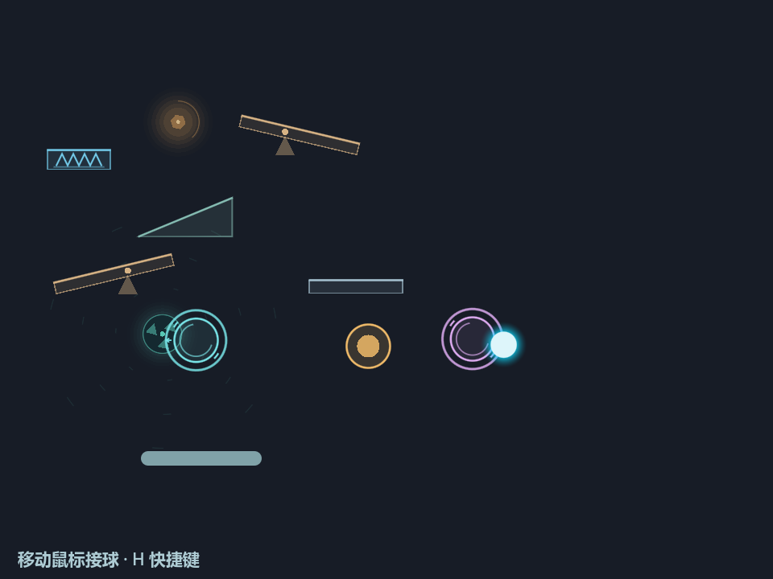
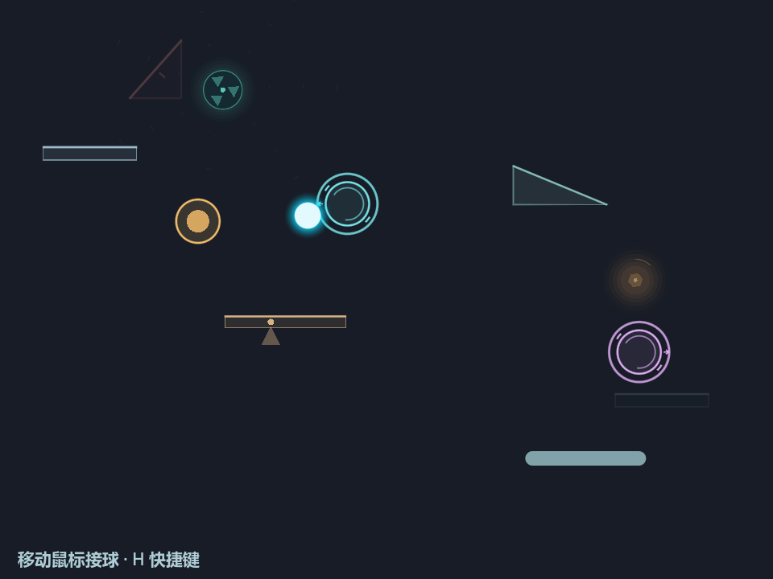

# 第二批harvest：成对传送门

> 第二批实施记录：保存成对门户与本体避让的参数、验证和反馈过程，各节按当时版本读取。该批已随[0.2.1](../releases/v0.2.1.md)发布；当前工作范围见[计划](harvest-refinement-plan.md)，下文旧待验收／停止点不作为当前状态。

日期：2026-10-01。运行时起点 `79b9de0`，文档与授权停点 `ca9f1c0`。用户已针对第一批反馈“集成后体验良好”，要求按[原计划](harvest-refinement-plan.md#portal-harvest-20261001)继续。第二批已在 `codex/harvest-geometry` 实现并通过必要机器验证，停在人工试玩点；main保持 `79b9de0`，砖块未启动，本轮不自动合入main或推送远端。

运行时／测试／集成验证：6.1 Sol（`gpt-6.1-sol`），medium为执行选择。主代理负责设计与状态文档、需求／约束／风险审查和本地Git保存，核对最终指纹并为归档查看一张自然传送画面，没有重复运行已完成测试。

## 实现与物理边界

从随机游乐场 `4947b67` 的field_toys选择性迁入成对关系、逐球冷却、出口偏移与速度方向保持，形成 `scripts/world/portal_toys.gd`；未搬入其他场力、多球、抓球或砖块。Ball、Main、GeometryPlayground和现有geometry_feedback负责必要接线，没有新通用架构。

Ball只扫描实际move_and_collide已经行进的无阻挡路径；门户在后方碰撞结算前提交，阻挡入口的实体优先阻挡球，不隔墙传送，不结算被跳过的后方碰撞／补能／音效／捕获。传送保持世界坐标中的速度方向，统一使用当前共享限速，移除来源隐藏的760局部限幅；传送后清除不连续拖影和旧支撑，不改Vitality或Activity。

出口固定在配对门外：A口向左、B口向右，距离为门半径27＋实际球半径＋7。提交时复核场地完整球半径＋2边界、真实圆形碰撞查询与几何完整运动包络。阻塞就拒绝，球位置／速度／冷却不变，不夹到边界或搜索替代出口。RESTING及弹簧持球不传送；同一球有冷却且需离开两口才重新解锁，不同球的锁独立，同一请求不能重复提交。

配对采用相同缺口标识、青／紫双口和出口短箭头；实际提交后两口同步短闪，现有反馈模块播放一次短合成音。仅完整active可传送，淡入／淡出不触发；门户成对离场，最多一对。几何、转子、能量块、1.5×速度／2.25×重力、弹簧0.20秒／50%有上限横速、挡板y570及E01生命周期保持。

## 本轮实际临时参数

| 参数 | 生效值 |
| --- | --- |
| 同时上限／门半径 | 一对／27逻辑像素 |
| 首次出现等待 | 8–14秒 |
| 完整active时长 | 12–18秒 |
| 淡入／淡出 | 各0.65秒 |
| 完整离场后间隔 | 20–32秒 |
| 生成重试 | 最多24次候选；失败后等3秒再试 |
| 每球同对冷却 | 0.65秒，并要求离开两口后再解锁 |
| 传送双口闪动／声音 | 0.22秒／0.16秒 |

均为代理实施选择，不代表用户指定或永久参数。声音沿用现有三声部、静音与音量限制，声部饱和时仍可能丢弃多余声音；人工听感未验收。

## 试玩、对照和组合

- 默认双击[run-playtest.bat](../../run-playtest.bat)或编辑器F5，体验当前门户版；首对需等待8–14秒再淡入。
- `run-playtest.bat --no-portals --geometry-seed=184`回到第一批无门户共存；启动器保留editor／test／check，同时支持通用游戏参数。
- [run-geometry.bat](../../run-geometry.bat)和两档运动启动器继续为纯几何对照；`--geometry-baseline`原世界底座与`--v02-baseline`无世界对照均不建门户。
- R保持种子、N换种子，同步重开当前模式的三类对象并安全发球；F8保存、F9恢复组合，保持本会话运动参数。

| 模式 | 格式与最近文件 |
| --- | --- |
| 默认门户共存 | version3，`world_mode=coexistence-portals`，`.godot/geometry-snapshots/latest-portals.json` |
| `--no-portals` | 原version2／coexistence，`latest-coexistence.json` |
| 纯几何 | 原version2／geometry-only，`latest.json` |

外层profile仍为 `geometry-refinement-v2`，rules仍为 `spring-200ms-lateral50-motion150`；门户内层version1保存双口、配对、phase／timer／clock、随机源和生命周期记录。默认v3拒绝旧v2且不先修改对象；旧组合在对应对照中打开，最近文件互不覆盖。F9恢复对象及随机进度后重新安全发球，逐球冷却和瞬时闪动清空；不是球轨迹、输入或F1设置的重播。

## 实际验证与证据

Windows／Godot4.7 Compatibility；从 `.local/godot.local.txt` 使用既有console。全部命令、退出码、时点、日志与最终源文件SHA在本机 `.godot/portal-harvest-20261001/` 的 `report.md`、`results.json`、`final-fingerprints.json`，封存2026-10-01 00:35:51 +08。主代理核对10个运行时／测试文件与指纹一致，GD源码均LF。没有修改系统设置或安装依赖。

| 验证 | 最终结果 |
| --- | --- |
| 默认1.5×门户专项 | 39检查：扫掠／掠边／近失、去重、逐球锁、phase、持球／RESTING、实体／跷跷板完整包络／挡板／边界出口、真实飞行与碰撞先后、一次声音、拖影、快照及离场 |
| 核心与基线 | 核心572，1×底座物理851、音频38；旧1×断言在显式current对照运行，默认fast由门户专项覆盖 |
| 原共存与几何 | `--no-portals`共存2136，纯几何17，几何音频29（包含新增门户波形） |
| 入口／快照 | 默认12，no-portals／geometry-only各5，baseline1；R／N／F8／F9与跨版本拒绝 |
| 真实batch分派 | 仓库临时Godot shim仅添加测试参数，no-portals5、首参数seed12通过；保留管理命令，测试环境还原 |
| 导入／启动 | headless import、默认1200帧、归档图片后补import均退出0 |

汇总19项命令均退出0，最终日志检查无SCRIPT ERROR／ERROR／WARNING或泄漏。运行时在自然与回归前冻结；其后只修改启动器转发和新增四条包络／掠边断言，对应batch与39项门户专项补验通过，其余结果不伪装成重复执行。

保留的红测试：默认缺门户、显式请求可重复提交、batch不转发参数分别先失败后通过。一次测试fixture的typed Array赋值出现SCRIPT ERROR但退出0，未计通过，修正后检查完整日志；另一次JSON整数／浮点表示比较差异只修正测试表示，没有放宽物理规则。

## 自然片段与观察

seed184，真实OpenGL，10800物理帧／180模拟秒，最大采样间隔一物理帧。只输入鼠标式挡板目标，未强制球初态或碰撞：五次配对出现，四次自然传送发生于68.10、106.73、139.18、151.27秒；首对12秒淡入、12.65秒激活。累计active约65.77秒；最多两口与六几何，速度峰值约780（浮点误差范围），0越界恢复、0碰撞预算耗尽；三种活力状态均出现，RESTING378帧。

实现代理查看自然与受控实际渲染：球出现在紫口，双口短闪可辨，未形成入口到出口的长拖影；青口靠近原转子，场力自然交叠未被隔离。主代理仅为归档查看上述代表图。受控图为固定双口／球初态后真实运动24帧、一次传送，独立标记，不算自然发生。捕获静音，声音仅有机器路由／参数证据。

自然证据保留在 `natural.log`／`natural.json`／`natural-*.png`，受控证据为 `controlled.log`／`controlled.json`／`controlled-transport.png`。归档图与源 `natural-transport.png` SHA-256同为 `DCC9F093C76AC6719181F6C177C37C4616ED92A062F3CB20A1BD15AE290706DB`，源文件未删除或修改。

已实现、机器通过与代理观察如上，门户尚未获用户试玩验收。一个种子和脚本输入不能证明长期体验；重点待判断：是否低频而有分量、转子近门时是否可读、传送后球路是否自然、声音及整体手感。F01／F05、F07、T01保持开放，F06仍待体验复核，亮边后置，砖块不启动。

原始 `docs/user-feedback.md` 仍未跟踪，SHA-256不变：`78929B277A53557896D3C993F38B17A1962312D6501C1131534D63212A39DB37`。

## 2026-10-01：本体生成避让补齐

用户要求传送门与转子本体不重叠，能量块也避开已有实体，并明确补充：基本生成避让应成为实体默认能力检查；代码须允许未来有意重叠的实体，以最小抽象避免机制清单膨胀和维护耦合。此项是第二批打磨授权，不是门户体验验收或main合入授权。修正起点为 `f93f61f`；以上首版证据与图片保留为历史。

本轮边界：复用完整几何运动包络、转子核心、能量块和门户双口的占用范围；默认参与共享生成避让，未来允许重叠的实体通过明确策略退出。外围场力、光晕和传送闪动不占位。各族通过共享查询接入，不维护彼此类型清单，也不建立通用实体框架。淡入、活动、等待和仍可见的淡出对象保留占位；候选尝试有上限，无合法位置就延后，不强制重叠生成。

能量块当前使用Area2D感应球经过，提供Vitality而不产生实体反弹；感应实现不等于豁免生成避让。首版门户的碰撞查询不能覆盖这个感应区，且门户未完整接入其他族的反向生成检查。本轮补齐占用检查，不改变能量块补能、转子场力、运动尺度、密度或生命周期时长。能量块与转子在同一个spawn_region内随机采样，并未要求能量块处于转子FIELD_RADIUS内；外围场域较大，允许自然覆盖能量块。

R／N、固定对照、生成与激活复查及组合恢复均需使用一致规则。旧v3中合法组合继续兼容；存在本体重叠的组合在修改当前世界前明确拒绝，不静默重摆。验证由原6.1 Sol代理负责，最终证据追加于本节。

### 实际实现与本轮验证

Main持有轻量 `SpawnOccupancy`；机制族作为provider注册，只报告自身 `entity_envelopes`，生成检查通过同一 `is_clear` 查询。注册默认参与；`participates=false`双向退出共享本体占用，但不跳过原有边界、球、挡板、同族形状细检或实际出口碰撞检查。provider使用弱引用并在退出时注销；无需保存查询服务本身。快照由各provider报告 `snapshot_envelopes`，通过同一规则预检。该层不是通用实体系统，也没有新增逐个实体的策略配置界面。

本轮6.1 Sol实现／验证，基于 `f93f61f`；完整命令、退出码、日志和最终源码指纹保存在 `.godot/portal-clearance-20261001/`。50项定向检查通过，覆盖Area2D双向避让、所有可见阶段、完整运动包络、场域可交叠、默认策略与显式退出、注册清理、有限失败、激活复查及旧v3重叠组合无副作用拒绝。相关回归：核心572、物理current对照851、门户39、无门户共存2136、几何45；入口默认／固定各12、无门户／纯几何各5、底座1。Ball及音频没有修改，本轮未重复音频测试。最终共3728项适用检查通过，截图归档后的headless import与默认场景1200帧均退出0；最终日志无SCRIPT ERROR／ERROR或泄漏。2026-10-01 01:40:37 +08封存 `report.md`、`results.json`、`fingerprints.json`，主代理核对8个源文件指纹一致，均为LF；测试后无运行时修改。

seed184实际渲染运行7200物理帧，出现5次自然传送；逐帧异族本体包络重叠0、越界恢复0、碰撞预算耗尽0。实现代理检查实际截图；主代理仅为归档查看下图，没有重复游戏测试。场域仍可自然覆盖其他本体；单个种子与脚本挡板输入不代表长期体验验收。

归档图与源 `.godot/portal-clearance-20261001/natural-transport.png` SHA-256同为 `2A7353E7809CF16BAE6E7C59AC1262FD41031B0919FE225D134A85B02656D816`。首版图片与原证据保持。main仍为 `79b9de0`，本次只保存实验分支；门户整体体验仍待人工试玩。
