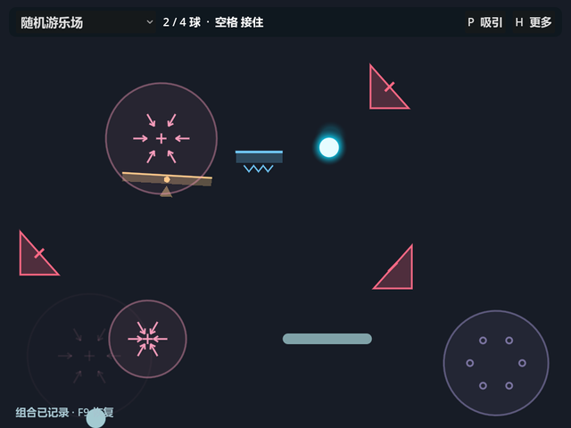
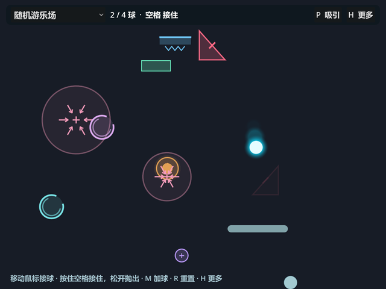

# 游乐场试玩记录

探索实现日期：2026-09-13；用户试玩反馈：2026-09-16；反馈吸收与调查汇总：2026-09-23。实现与探针：Codex low代理；方向、证据判断与文档：主代理。用户反馈、代理调查及候选方案分别标注。

本页low代理归属记录历史执行事实。后续任务采用[当前代理纪律与交付格式](../../AGENTS.md#agent-execution-policy)，明确区分已实现、机器通过、代理观察与用户验收；主代理不作为每次测试或观察的重复执行者。

2026-10-01 当前状态：第一批几何与原有转子／能量块共存已在 `fa099e4` 实现并本地快进合入main；旧main `f792d3b` 和纯几何停点 `287ac0c` 保留可返回。默认单球六类几何与转子／能量块共同运行，纯几何及底座对照仍可用。1.5×速度／2.25×重力与弹簧0.20秒／50%有上限横速此前已获用户试玩通过；独立亮边已撤下，其余球形变、声音层次及Vitality变暗保留。2026-10-01用户已反馈共存版“集成后体验良好”；第二批门户与默认本体避让 `d26c9f1` 已获用户明确试玩通过，并授权按计划继续第三批普通砖／反向砖；第三批已于 `codex/harvest-geometry` 实现并通过必要机器验证，待人工试玩，main保持 `79b9de0`。 详见[当前方案](harvest-refinement-plan.md#brick-harvest-20261001)。下方旧运行命令属于广度探索。

## 2026-09-23：反馈吸收与问题登记

来源为用户维护的 `docs/user-feedback.md`（ISSUES三条、raw idea六条）及本轮明确要求。原稿保持原字节、未跟踪且不纳入本次提交；2026-09-23版本的SHA-256为 `088003696D5E01C23223A208FC64C80CCE1FD2F6E05823DDDDBE499B998FB6A2`。本表是已吸收问题的正式跟踪入口，原稿不再作为这些事项状态的唯一依据。吸收问题不等于采纳原文中的每种解法；没有把待比较方案记为已拒绝。

| 编号／原始事项 | 已明确的问题或目标 | 当前处理状态 |
| --- | --- | --- |
| F01／ISSUES：重新弹起只有直线、不好接 | 球回到底部后应有可理解、可实际操作的重新接入机会 | **准备解决**。当前竖直起跳、挡板底面阻挡和Continue狭窄高度窗口均需考虑；增加随机横速或改起跳方向尚未采纳 |
| F02／ISSUES：弹簧抓住球后的速度表现不理想 | 自动抓住—压缩—释放应形成清楚且满意的运动衔接 | **本轮试玩通过（`b118a5d`）**。0.20秒持球、50%有上限来球横速保留；正常与异常释放同源，用户明确确认“这一版通过了” |
| F03／ISSUES：上限和平均速度可以更快，暂定翻倍 | 提高整体运动的活跃程度，让玩家能随时专注于不费神的交互 | **本轮试玩通过（`b118a5d`）**。2×／4×强对照后改为速度1.5×、重力2.25×，用户已明确确认此版通过；保留为后续尺度，不视作参数永久冻结 |
| F04／raw idea：挡板移速影响球，或增加球速 | 玩家介入的回应与场地尺度应匹配 | **问题并入F03；解法待比较**。现有E01只按接触位置有限偏转，没有速度传递；是否加入以及强度均未决定 |
| F05／raw idea：挡板下难以让球弹起，Wake／Continue需更可感知 | 区分“动作是否触发”“起跳是否受阻”“能否重新接球”，共同改善理解和参与机会 | **准备解决**。功能并未整体失效；受控探针能触发并接回，但不代表人工操作轻松，不能仅用加提示宣布问题解决 |
| F06／raw idea：挡板下方区域规划、下方留空 | 减少底部几何占据重新参与空间 | **本批实体已落实，保留验收项**。完整包络避开底部及挡板横向路径；不是所有未来机制的永久禁区，也不证明全部底部问题消失 |
| F07／raw idea：底部与正上方障碍物循环一段时间 | 识别并处理妨碍玩家重新参与的反复球路 | **仍需解决／验证**。净空只减少一种来源；与F01、F05一起观察，不把自然往返或所有奇怪组合都列为必须消除的错误 |
| F08／raw idea：部分对象碰撞后加快消失，如弹簧 | 是否用碰撞影响离场节奏，尚无已确认的必要性 | **候选方案保留**。未实施、未拒绝，也未列入当前准备实施范围；先判断它要解决的具体重复或等待问题，不与真实支撑期间延期混为一谈 |
| F09／raw idea：独立试玩者认为球与挡板反馈不够强 | 真实接触需要足够可辨、与作用力度相称的反馈 | **亮边撤下／其他反馈保留（2026-09-30）**。用户认为独立受击亮边当前效果不佳，移除实现与专属测试，待以后优化UI/UX再考虑；球法向形变、声音层次及邻近地面音优先级保留，不据此声明听感验收 |

另保留 **T01：挡板侧向短暂重叠**，属于已证实的既有技术问题，不能从本批零几何重叠结果推断其已修复。后续重新接入／挡板工作需跟踪它；它不是本轮才引入的新回归。

当前文档统一、main集成及转子／能量块共存验证已完成，见[本轮结果](geometry-harvest-batch1.md#coexistence-result-20260930)；10月1日用户已反馈共存版体验良好，按原计划继续第二批。F01／F05、F07、T01仍开放；F02／F03已获 `b118a5d` 试玩通过；F09亮边撤下留待以后UI/UX优化，其余反馈保留；F06保留体验复核，F04／F08仍为候选。挡板维持y570，下移约620未采纳。原稿当前指纹及后续边界见[集成方案](harvest-refinement-plan.md#main-integration-20260930)，旧指纹不代表9月30日追加后的版本。

## 用户试玩结论（2026-09-16反馈）

广度游乐场已经实际试玩；它成功带来了可harvest的机制候选。用户观察到：

- 加入几何／机械结构后，世界明显更丰富；球能在空中与结构自行发生连续碰撞，运动行为更多样。
- 普通几何结构已经成立，不需要为每种形状增加持久状态、耐久、记忆或奖励。
- 当前弹簧主要是更强的上抛，独有动作不够明显。
- 当前跷跷板自行周期摆动，往往只像一块碰巧有角度的斜面，碰撞与板运动的关系不清楚。
- 底部实体可能与竖直回弹组成反复上下循环，玩家难以重新参与，只能等待实体消失。

这些是用户对已交付版本的反馈，不是实现代理根据测试计数推断的趣味性结论。新实现是否改善体验仍需再次试玩。

## 由反馈形成的当前设计决定

弹簧改成无需玩家输入的“接触—短暂抓住—明显压缩—有力释放”；跷跷板取消固定正弦驱动，同一次真实撞击同时改变球的运动与板的有限转动；底部减少持续占据球路的实体几何，给球回到底部后重新发生挡板互动留出空间。这里关注物体自身动作和交互优先级，不采用“玩家／系统控制权”的解释。

同时修正平台支撑球时到期突然失去碰撞的问题，等真实支撑结束再离场，并移除没有明确设计依据的机关附带Vitality奖励。基础几何保持简单；密度、寿命和大致生成频率本轮不全面重调。进一步范围及验证见[第一批记录](geometry-harvest-batch1.md)。

“没有意义的好玩”是这些取舍的上位判断：碰撞、弹出、拼合与摔碎可以直接构成玩的意义，无需积分、任务、奖励或长期收益。

## 实现选择与证据的归属

抓取／压缩时长、释放速度、跷跷板转动系数、阻尼／回复、净空余量以及继承的max6、10–24秒寿命、1.5–3.5秒生成间隔，均属于实现阶段的临时参数，不能写成用户指定数值。机器检查验证运动、碰撞和有限结束，实际渲染检查阶段表现；人工再次试玩才判断动作是否清楚、是否拖沓、密度与寿命是否合适。

下方按原提交保留探索机器证据和当时编排意图；其“待用户判断”表示当时状态，当前已收到的反馈以上文为准。

这是一批可玩的想法种子。当前默认进入随机游乐场；下文先保留固定阶段的实现与证据，再记录随机阶段。没有依据旧理念提前删除机制，也没有把默认选择记成用户的最终筛选结论。

## 固定组合的意图（`6f31ea7`）

从接球开始，按住空格抓住真正接到的球，松开时把它抛向场内。两球提供互相错开的运动节奏；可以只追一颗，也可以尝试同时接住更多球。

中下方的向上加速环通向两段砖。砖先裂开，再碎开，空出的通道暂时改变球路。左侧弹跳器与磁场叠加，既可能把球送走，也可能把它再次带回碰撞附近。两侧门户把一次看似结束的弧线接到另一侧；弹簧、侧踢与摆板再提供不同方向的机会。

这是编排的体验意图；具体接触顺序由实际物理、输入与多球相位产生，不是脚本演出。没有要求玩家完成这条路线。

## 已完成的组件

| 碰撞对象 | 实际行为 |
| --- | --- |
| 金色圆形弹跳器 | 径向弹出，最低速度460；撞击膨胀与增亮 |
| 蓝色弹簧平台 | 顶面向上弹起610，压缩反馈 |
| 粉色三角侧踢 | 向左上弹出550 |
| 琥珀摆板 | 在±0.26弧度内摆动的物理表面 |
| 绿色两段砖 | 两次击中破碎，10秒后等全部球离开再生 |
| 紫色小靶 | 击中消退，5秒后安全再生 |

固定默认碰撞层另与吸引／排斥磁场、成对门户、向上加速环组合。其他可选布局保留风道、阻尼、升力／低重力区域。场力请求由 Ball 的物理入口验证和提交，传送出口还要避开真实实体。

默认布置不是机制目录：它优先形成可相互作用的球路；单独布局和混合入口供之后对照、扩展和试玩筛选。

## 固定阶段验证

碰撞组件43项检查通过，包含真实碰撞、限速、方向、耐久、多球再生排除及移除；场力组件19项通过，包含极性、阻尼、入口边沿、每球冷却、边界与停用。两组都已有实际OpenGL渲染，主代理查看默认形状与响应对照。

固定组合已可玩并完成接线验证。实现代理执行6布局场景5431项、120秒多球演化25802项，速度峰值约520，越界恢复0；基线对照核心555、物理851、共享场景8、音频38、E01 38通过。隔离配置导入完成，正常清理退出无泄漏。

20秒演示只改变鼠标目标和空格输入，没有注入球的轨迹：接住5次、抛出4次、加速8次、砖接触6次、传送3次；首个接住在frame38、抛出93、加速103、砖接触122、门户400。120秒2→4球输入模拟发生接住45、抛出44、加速64、砖接触39、传送22次，全静止帧0。证据为 `.godot/toybox-capture-evidence.json` 与实现代理的 `.godot/toybox-*.log`；它们证明机制能形成连续过程，不替代用户的趣味性判断。

主代理查看完整默认及门户演化截图，并代表性执行默认主场景1200帧，退出0、无资源泄漏（`.godot/root-fixed-toybox-1200.log`）。没有重复子代理整套回归。引擎仍有系统证书存储读取提示，离线游戏和测试不受影响。

## 固定版操作与限制

鼠标横移；空格按住接球，持有最多1.2秒充能，松手向上抛出310–500。真实挡板顶面接触有限传递横速，系数0.28、增量上限145。M加球，上限4；R重置为1球。G切换重力260／95，Shift按住慢速0.35，W切换挡板宽度150／220，P切换磁极，H帮助，反斜杠隐藏整栏。

1–6、Tab或左右键选择布置；0恢复原版单球；T切换碰撞玩具、Y切换场力。T改变实体布局时重置发球位置，Y不重置。F1、F5、F7保留。玩具球彼此不碰撞；原版0不提供多球。启动 `--toybox-baseline` 则不实例化探索层，完整返回V0.2.0底座。

## 当前默认：随机玩具组合

固定版于本地实验分支保存为 `6f31ea7`，未合入main。用户随后明确：固定布局保留为确定性基线，不继续在固定位置关系上投入大量精修。接续重点为多玩具随机出现、随机停留与消失，让现有物理自然产生组合，不枚举或安排每种组合的正确结果，不为避免奇怪互动而隔离玩具。只保障生成基本合法，并尽量记录可复现的种子、出现时序与组合。

两类模块已加入独立随机生命周期，允许同类多实例及场力重叠。下列频率与寿命是代理的临时实现选择，供试玩后改造，不是用户逐项决定的规格。

| 随机模块 | 出现与停留 | 共存规则 |
| --- | --- | --- |
| 弹跳器、弹簧、三角侧踢、两段砖、小靶、摆板 | 开场约0.1、0.55、1.0秒尝试生成，随后每1.5–3.5秒；寿命10–24秒，离场0.65秒 | 最多6个实体，允许同类重复；实际碰撞形状排除越界、球、挡板和实体初始重叠 |
| 磁场、风、升力、阻尼、旋涡、加速环、成对门户 | 首次0.5–1.5秒，随后每2–4秒；寿命8–22秒，淡入／淡出0.65秒 | 最多4组，允许任意重叠与同类共存；门户一对为一组，一同离场 |

实体允许出现在挡板下方，只在顶部留34像素可读带并保留边缘余量；摆板按运动包络检查生成是否合法。非实体场力不充当禁止生成的区域。实体离场时立即停用碰撞并淡出；砖／小靶自身的再生不会延长整体寿命。力随淡入出强度变化，门户和加速环仅在完整启用期触发。入口与冷却按每球、每机制ID记录，一对门户的防回跳不会拦截其他门户对。

持球随挡板移动也经过实体碰撞检测，受阻时球停在真实位置，松手从该位置抛出。随机生成不会移动球给玩具让路。资源上限、速度上限与基本几何检查保留，未枚举组合结果或要求球遵循正确路线。球与球之间暂不碰撞。

### 操作与复现边界

默认随机模式以两球开始；R以当前种子重开两球，N换种子，M加球至最多4颗。空格抓住／抛出，G重力、Shift慢放、W挡板宽度、P磁极、H帮助及其他开发按键沿用。模式菜单可返回固定布局，随机模式编号7；启动 `--toybox-fixed` 选择固定游乐场，`--toybox-baseline` 返回完整旧底座。

启动 `--toy-seed=184` 指定主种子；实体使用主种子，场力使用主种子 XOR `0x5f3759df`。相同种子和相同物理／输入上下文可以重复生成；鼠标输入改变球的位置后，合法生成重试也可能改变后续结果，不能把同种子等同于同一场景录像。

F8将当前组合保存为 `.godot/toybox-snapshots/` 下的JSON；F9恢复最近组合，然后安全重新发两球。组合包含玩具位置、耐久、剩余寿命、摆相、生成计时、随机源进度与生命周期记录；RNG的64位值以字符串保存，避免JSON数字精度丢失。恢复的是玩具组合及其继续演化能力，不恢复原鼠标输入，也不是逐像素重播。新球的碰撞与生成排除上下文仍会影响之后的过程。

### 随机阶段验证

2026-09-13，Windows / Godot 4.7 Compatibility。碰撞代理完成59项，场力代理完成29项，覆盖同种子、JSON恢复后的随机演化、基本生成几何、同类共存、独立冷却、有限寿命和资源回收；场力另有实际OpenGL 60秒生命周期捕获。

核心代理在持球几何修正后完成随机集成43206项：种子7、184、20260913各120秒、两球，使用鼠标与空格输入；速度峰值约520，越界恢复0，两类组件均到达全部生命周期阶段，每组最大6个实体与4组场力。种子7无门户／加速事件，184出现6次传送，20260913出现1次加速，保留这些自然差异，没有为了覆盖事件调整成固定路线。安全初始发球等待产生2个全静止帧。日志 `.godot/random-postgeometry-tests.log`。

持球遇实体的针对性5项通过：实际顶面抓取、随动碰撞、球受阻而挡板继续移动、从真实位置释放以及无穿透。F8/F9验证包含JSON恢复随机源进度、有效玩具数量和安全重新发球。命令行快照与真实Viewport空格输入6项通过，含绝对路径和 `res://` 两种入口；顶部按钮与选择控件不持有键盘焦点，空格／Shift先于GUI处理。核心555项、物理851项通过，进程隔离APPDATA导入完成。

主代理另执行默认主场景1200帧（`.godot/root-random-toybox-1200.log`），退出0、无脚本错误；出现8实例／2资源的退出占用提示。核心代理定向定位为按帧数强制退出恰好截断原有OGG混音：完全不加载Toybox的基线也可精确复现，同一探针等待300毫秒真实混音清理后消失，两个默认1200帧复跑亦无警告；涉及旧OGG音源、包序列及三个播放声部，没有为此修改产品代码。引擎原有系统证书读取提示仍在。

完整检查由各实现代理执行；主代理仅对代表性实际画面与启动结果作判断，不重跑全部检查。当前机器证据不代替用户对偶然组合是否有趣的试玩判断。

### 可重开的实际组合

主代理查看了同一次真实渲染的30秒与50秒完整窗口。30秒时多个磁场与摆板、弹簧、侧踢并存，50秒时已更替出门户和弹跳器。它们来自seed184的鼠标与空格输入演化，没有注入球轨迹或重新编排位置。到30秒累计接住／抛出各10次、砖4次、摆板2次、侧踢1次；到50秒累计传送1次、加速3次。





[30秒组合JSON](snapshots/random-toybox-184-30s.json)由实际F8保存，此刻共6个实体（5个活跃）、4组场（3组活跃）；[演化证据](snapshots/random-toybox-184-evidence.json)记录生命周期与事件计数。快照、证据和图片均从原 `.godot/` 输出复制归档，长度与SHA-256一致；原文件保留。快照SHA-256：`BD8C499028104FCE3A23B3EEDEF8DEAB2C929041AB4388881A47D79E57711FC0`。

在仓库目录运行：

```powershell
.\run-toybox.bat --toy-snapshot=res://docs/exploration/snapshots/random-toybox-184-30s.json
```

命令恢复这个玩具组合并发两颗新球，再按剩余寿命与随机进度继续。`--toy-snapshot=` 也接受带空格的绝对文件路径；直接调用Godot时放在 `--` 之后。

参考来源及本轮范围见[物理电子玩具探索](physical-toy-exploration.md)。
